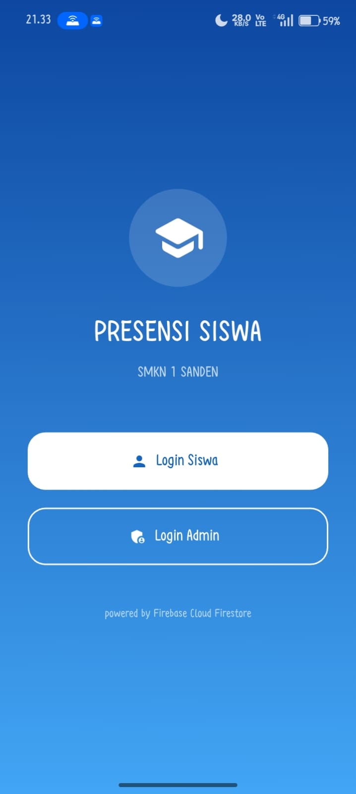
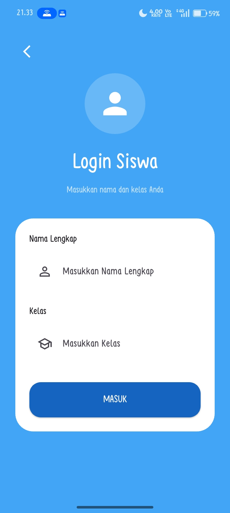
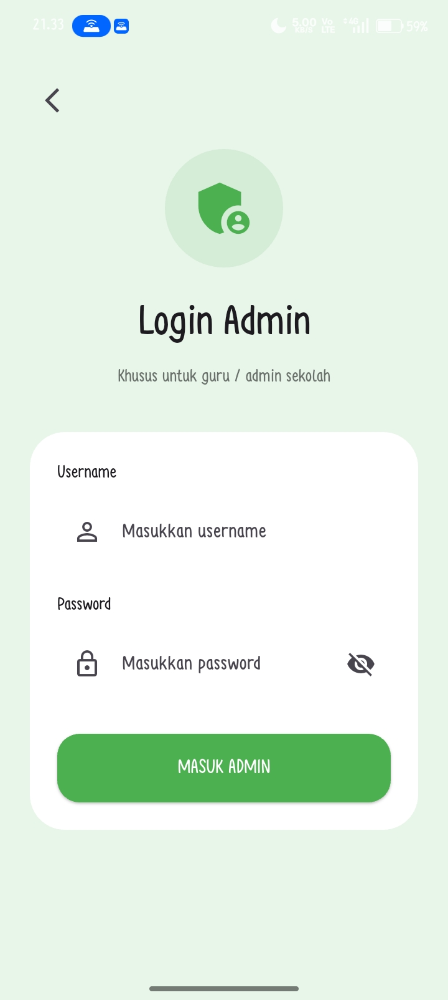
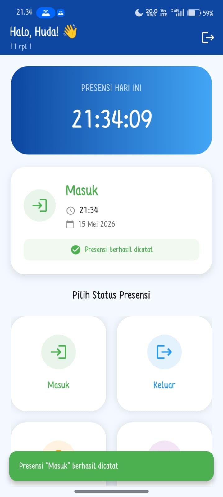
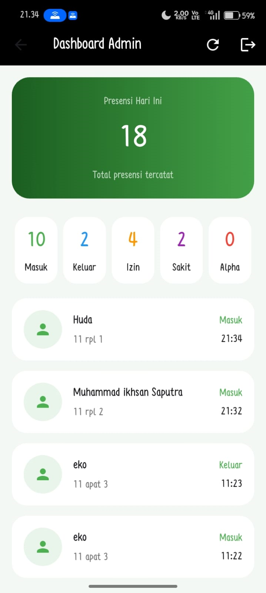
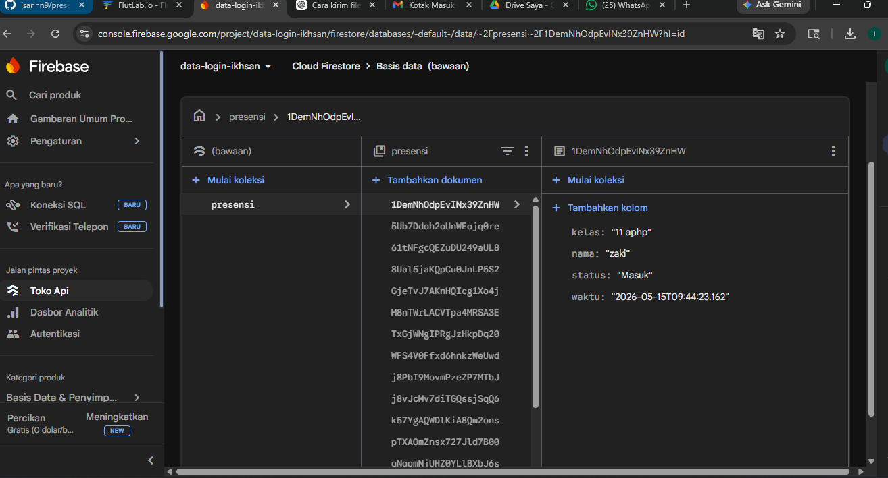

<div align="center">

# 🚀📱 PRESENSI ONLINE FLUTTER FIREBASE

### ✨ Aplikasi Absensi Digital Modern Untuk Sekolah ✨



💡 Dibuat menggunakan **Flutter** dan **Firebase**  
⚡ Realtime • Modern UI • Mudah Digunakan

---


</div>

---

# 🌟 FITUR UNGGULAN

✅ 🔐 Login Siswa  
✅ 👨‍💼 Login Admin  
✅ 📥 Presensi Masuk  
✅ 📤 Presensi Pulang  
✅ 🤒 Presensi Sakit  
✅ ❌ Presensi Alpha  
✅ 📊 Dashboard Realtime  
✅ 🕒 Riwayat Presensi  
✅ ☁️ Firebase Firestore  
✅ 🎨 UI Modern & Responsive  

---

# 📸 SCREENSHOT APLIKASI

## 🏠 Halaman Awal


---

## 👨‍🎓 Login Siswa


---

## 👨‍💼 Login Admin


---

## 📊 Dashboard Siswa


---

## 🧑‍💻 Dashboard Admin


---

## 🔥 Firebase Database


---

# 🛠️ TEKNOLOGI YANG DIGUNAKAN

| 💻 Teknologi | 📌 Fungsi |
|---|---|
| Flutter | Framework aplikasi mobile |
| Firebase | Backend aplikasi |
| Cloud Firestore | Database realtime |
| Dart | Bahasa pemrograman |
| Material UI | Desain tampilan aplikasi |

---

# 🚀 CARA MENJALANKAN PROJECT

```bash
# 📦 Install dependency
flutter pub get

# ▶️ Menjalankan aplikasi
flutter run
```

---

# 📂 STRUKTUR PROJECT

```bash
lib/                # 📱 Source code Flutter
assets/             # 🖼 Asset gambar & logo
screenshots/        # 📸 Screenshot aplikasi
android/            # 🤖 Konfigurasi Android
ios/                # 🍎 Konfigurasi iOS
pubspec.yaml        # 📦 Dependency project
README.md           # 📖 Dokumentasi project
```

---

# 🔥 FIREBASE COLLECTION

```bash
presensi
riwayat_presensi
```

---

# 👨‍💻 DEVELOPER

| 👤 Nama | 🛠 Role |
|---|---|
| Muhammad Ikhsan S | Developer & UI Designer |

---

# 📌 TUJUAN PROJECT

Project ini dibuat untuk memenuhi tugas sekolah dengan tema:

> 📱 "Pembuatan APK Absensi Menggunakan Smartphone"

---

# 🌈 KEUNGGULAN APLIKASI

✨ Tampilan modern dan elegan  
⚡ Sistem realtime menggunakan Firebase  
🔒 Login Admin & Siswa  
📊 Monitoring presensi lebih mudah  
☁️ Penyimpanan data online  
📱 Responsive di berbagai ukuran layar  

---

# 📅 TAHUN PEMBUATAN

🗓️ 2026

---

<div align="center">

# ⭐ TERIMA KASIH ⭐

💙💙

</div>
